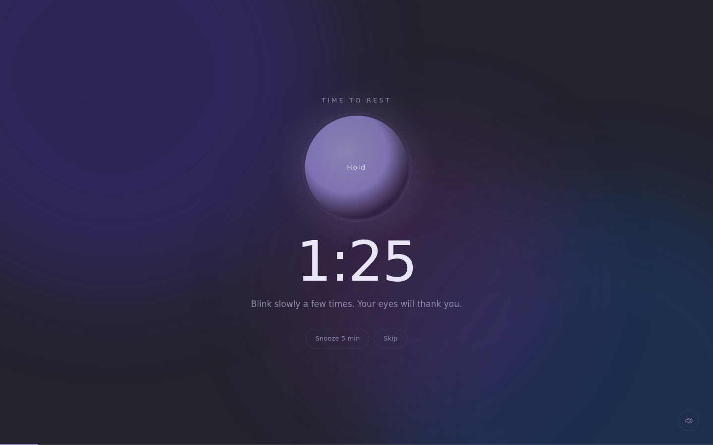
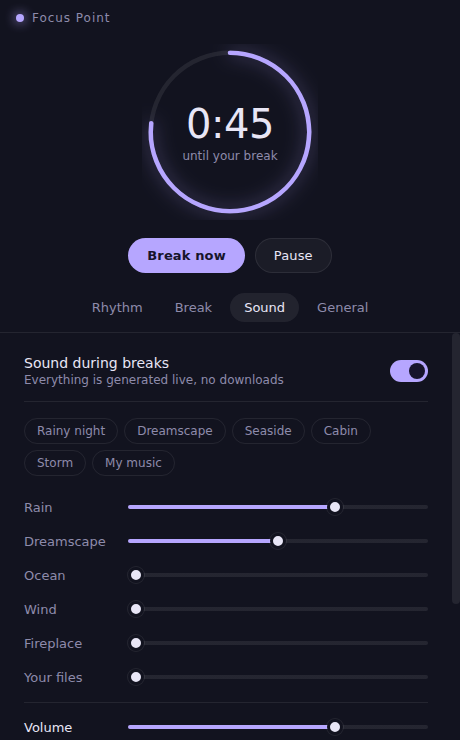

# Focus Point

A calm break reminder for Windows. Every so often (45 minutes by default) it gently takes over your screens and makes you rest for a minute or two, with a breathing guide and soft rain or dreamy ambient music.

<p align="center">
  
  
</p>

## Features

- **Break screen on every monitor.** It covers the whole screen, stays on top, and fades in and out slowly.
- **Breathing guide.** An orb for 4 · 2 · 6 breathing (in, hold, out). A longer exhale helps you calm down.
- **Generated sounds, no downloads.** Rain, ocean waves, wind, fireplace and a *Dreamscape* pad (slow chords, distant bells, long reverb) are synthesized live, so they never loop audibly. Mix them with sliders or pick a preset: Rainy night, Dreamscape, Seaside, Cabin, Storm.
- **Your own music.** Add MP3/WAV/OGG/FLAC/M4A files. They're shuffled and mixed with the ambient layers.
- **Customizable rhythm.** Choose how long you work and rest, add a longer break every N breaks, and get a heads-up notification before each break.
- **Soft or strict.** Skip and Snooze buttons are optional. You can also turn on "Wait for me" so work doesn't restart until you click *I'm back*.
- **Strict mode.** No Skip or Snooze, and during a break Alt+Tab, the Windows key, Alt+Esc, Ctrl+Esc, Alt+F4 and Alt+Space are blocked. For an emergency, hold **Esc for 5 seconds**. Ctrl+Alt+Del and Task Manager (Ctrl+Shift+Esc) always work, and the block releases after 2 hours no matter what.
- **Break zones.** Set time ranges when you need to be present (meetings, classes, calls), e.g. *Team meeting, Mon–Fri 14:00–15:30*. Zones can run past midnight. Breaks never pop up inside a zone: the timer keeps counting, and a break that came due follows shortly after the zone ends.
- **Never interrupts your games.** If a fullscreen game, video or presentation is in front when a break is due, the break waits. Exclusive and borderless-windowed games both count. When you exit, you get a short heads-up and then the break. You can also set a maximum wait if you want a guaranteed break.
- **Knows when you're away.** Locking the screen, sleep, or being idle for X minutes counts as resting, and the timer starts fresh when you return.
- **Weekly stats.** See how much you rested each day this week, compared with the same point last week. Also shows breaks taken vs skipped, screen time, and rest per screen hour. Browse past weeks, or switch to a table view. History stays on your computer.
- **Lives in the tray.** Take a break now, pause for 15 min / 30 min / 1 h / 2 h, restart the timer, or quit.
- **Four themes:** Night, Dusk, Forest, Sand.
- **Starts with Windows** (optional) and runs quietly in the tray.

## Install (Windows)

**Easiest:** open the repo's **Actions** tab → *Build Windows app* → latest run → download **FocusPoint-Setup** → run the `.exe`.

To publish a proper release, push a tag such as `v1.0.0`. The installer is attached to a GitHub Release automatically.

> Windows SmartScreen may warn you because the app isn't code-signed. Click *More info → Run anyway*.

## Run from source

```bash
npm install
npm start          # normal
npm run dev        # fast mode: every "minute" is one second, handy for trying breaks
npm test           # timer logic tests
npm run dist       # build the Windows installer into dist/ (run on Windows)
```

## How it's built

| Part | File |
| --- | --- |
| Timer (work → break → work, long breaks, idle, snooze, pause) | `src/main/timer.js` |
| App shell: tray, windows, overlays on every display, notifications | `src/main/main.js` |
| Fullscreen game/video detection (Win32 APIs via koffi) | `src/main/fullscreen.js` |
| Rest history (per-day totals in `stats.json`) | `src/main/stats.js`, `src/renderer/stats-view.js` |
| Strict mode keyboard hook (`WH_KEYBOARD_LL`) | `src/main/keyblock.js` |
| Break zones (time ranges that hold breaks) | `src/main/zones.js`, `src/renderer/zones-view.js` |
| Settings saved to `%APPDATA%/Focus Point/settings.json` | `src/main/store.js` |
| Sound synthesizer (Web Audio API) | `src/renderer/audio/engine.js` |
| Settings UI | `src/renderer/settings.*` |
| Break screen | `src/renderer/break.*` |

The sounds are built from a few basic ingredients:

- **Rain.** Pink noise (softer highs than white noise, like real rain), a low brown-noise rumble, and tiny randomized droplet clicks panned across the stereo field.
- **Ocean.** Brown noise with its volume and filter swept by a very slow wave (~13 s per wave), plus a bright foam wash on each crest.
- **Wind.** White noise through a band-pass filter whose frequency drifts, which gives the whistle.
- **Fireplace.** A low roar plus random crackles and pops.
- **Dreamscape.** Lush 7th/9th chords (Cmaj9 → Am11 → Fmaj7♯11 → G6/9 → Em9 → Fmaj9). Each note is a pair of slightly detuned oscillators, played through a slowly opening filter and a 5-second generated reverb, with pentatonic bells on top.
